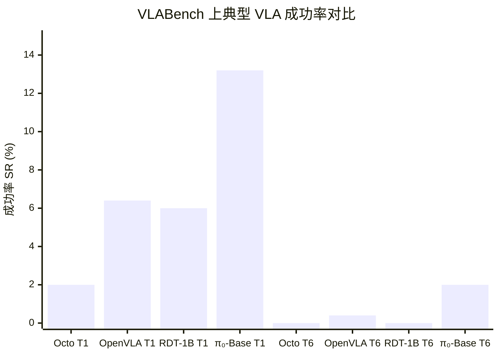
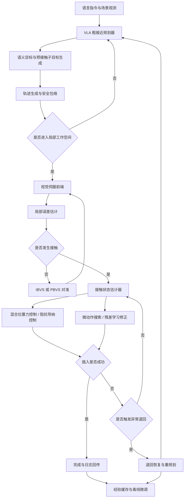
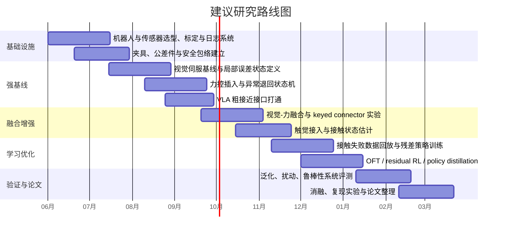

# VLA 作为高层粗接近规划器并外挂高精度修正器用于毫米级接触任务的可行性与实施分析

## 执行摘要

结论先行：**可行，但前提是把 VLA 从“末端接触控制器”降级为“语义—几何粗接近规划器”，并把真正决定成败的最后对齐、接触搜索、力控插入与异常恢复，交给一个高频、局部、可验证的闭环修正器**。这一判断与近两年的研究趋势高度一致：一方面，VLA 在语义理解、跨任务泛化、长时序多阶段任务中表现突出；另一方面，现有 VLA 在高精度、接触密集、强局部反馈依赖的任务上仍存在明显短板，尤其是早期自回归动作框架在高频控制、动作平滑性、接触反馈建模方面的不足，已经被 OpenVLA、π₀、ForceVLA、Tactile-VLA、VTLA、VITAL 等工作从不同角度证实。citeturn32view4turn22view0turn22view1turn40search0turn41view1turn39search0turn42view0

现有最强证据不来自“某一个模型已经端到端解决了插拔”，而是来自一组互补事实。其一，VLABench 这类更贴近基础模型能力边界的评测显示，微调后的 OpenVLA、Octo、RDT-1B、π₀ 在复杂、多维泛化任务上的成功率仍然普遍偏低，例如 Track 1 成功率仅为 2.0%、6.4%、6.0%、13.2%，而 Track 6 长时复合任务更低至 0.0%、0.4%、0.0%、2.0%。其二，OpenVLA 自身报告在多对象、多指令环境下有优势，但也明确指出在“窄而高巧手”的任务上，Diffusion Policy 的轨迹更平滑、精度更高。其三，接触任务一旦显式引入力/触觉，表现会出现跃迁：ForceVLA 在五类接触任务上较强 π₀ 基线平均提升 23.2%，插头插入可达 80%；Tactile-VLA 在充电器插入任务上达到 90%，而 π₀-base 与 π₀-fast 仅为 40% 与 25%，USB 任务上则分别只有 5%、0%、35%；主动推断式触觉插入在小于 0.1 mm 间隙条件下达到 90%，无触觉基线只有 5%。citeturn12view0turn10view2turn23view3turn40search0turn41view1turn15view2

因此，本报告建议的研究路线不是“让 VLA 学会最后 0.1 mm 的对齐”，而是设计一个**分层闭环系统**：VLA 负责目标识别、孔位语义匹配、粗接近位姿、插入轴估计、失败语义归因与再规划；局部修正器负责将误差从毫米级收缩到公差盆内，并在接触后通过视觉伺服、混合位置/力控制、触觉/力觉异常检测、微动作搜索与残差学习完成插入。这个设计与近年的分层 VLA 趋势、以及 “reaching phase + local interaction phase” 的 VITAL 框架高度同构。citeturn7search4turn32view4turn42view0turn43search2

工程上，这一方案的**最低可实施条件**是：机器人须开放至少 500 Hz 以上的低层控制接口；末端至少配 6 轴力/力矩传感器和一只腕部相机；若目标公差进入 0.2 mm 甚至 0.1 mm 档，则建议增配指尖视觉触觉传感器。官方资料显示，UR e-Series 控制系统更新频率为 500 Hz、重复定位精度为 ±0.03 mm；Franka Research 3 提供 1 kHz 低层运动控制接口；ATI EtherCAT3 力/力矩接口可达 8 kHz 更新；GelSight Mini 为 25 fps。换言之，**真正的接触闭环不应依赖大模型推理频率，而应依赖独立实时控制回路**。citeturn35search16turn35search1turn35search10turn35search3

从研究实施角度，本报告的最终建议是：先以“VLA 粗接近 + 视觉伺服 + 力控插入”为强基线，在此基础上再加入触觉、局部残差 RL 或轻量微调；同时建立专门面向插拔的评测协议，而不是只依赖 LIBERO / CALVIN / BridgeData V2 等通用基准。若实验资源有限，优先做**接口分层与切换策略**，其次做**视觉—力闭环**，最后再做**接触阶段学习化微调**。citeturn28view0turn29view0turn28view3turn32view0turn16view1

## 现状文献与证据

VLA 近年的主线进展已经很清晰：RT-2 证明了**Web 预训练知识可以迁移到机器人控制**，OpenVLA 把这一方向做成了大规模开源，π₀ 则进一步强调**高频动作块与巧手任务**，并把通用机器人策略推进到更高自由度、更长时序的真实系统。中文综述也已经明确指出，VLA 领域正在从“端到端单体模型”转向“分层 Planner-Controller、推理增强、跨模态闭环”并重的阶段，分层路线的重要附带收益是下层控制更灵活、推理速度更容易满足实时性要求。citeturn27view0turn22view0turn22view1turn7search5turn7search4turn32view4

但如果研究目标被限定为“毫米级接触任务”，尤其是插拔、对接、钥匙入锁、连接器插接、窄间隙轴孔装配，那么现有主流 VLA 的证据并不支持“直接端到端替代高精度对齐器”。原因主要有四个。第一，**评测错配**：LIBERO、CALVIN、BridgeData V2 的核心价值在于长时序、语言条件、跨环境与技能迁移，但它们并不把亚毫米或近亚毫米接触对齐当作中心问题；BridgeData V2 的主要技能也依然是抓放、推动、扫动、开关门抽屉、堆叠和布料操作。第二，**控制频率与表示问题**：OpenVLA 自身指出，Diffusion Policy 在窄而高巧手任务上依旧拥有更平滑、更精准的轨迹，而 π₀ 直接将“高频动作块”视为解决巧手任务的关键动机，并明确指出先前自回归 VLA 在这类任务上存在难点。第三，**感知模态缺失**：ForceVLA、TLA、VTLA、Tactile-VLA 都把论文动机直接表述为“现有 VLA 在接触密集任务中缺乏力/触觉感知”。第四，**长时与复杂任务上的实际成功率并不高**：VLABench 给出的结果尤其应当被重视。citeturn28view0turn29view0turn28view3turn23view3turn22view1turn40search0turn39search1turn39search0turn41view0turn12view0

下表汇总了与“VLA 是否能胜任毫米级接触任务”最相关的一组关键文献。为了便于研究实施，本表只保留四类信息：实验设置、可比的定量结果、与本问题的直接启示、以及证据成熟度。

| 文献 | 年份 | 任务与设置 | 关键定量结果 | 对本问题的直接启示 |
|---|---:|---|---|---|
| RT-2 | 2023 | Google kitchen 真实机器人；6000+ 次试验；考察已见任务、未见对象/背景/环境、以及 emergent skills | 在未见场景上从 RT-1 的 32% 提升到 62%；对 emergent skill 类任务相对既有基线提升超过 3×；Language Table 仿真成功率 90%，高于 BC-Z 72%、RT-1 74%、LAVA 77%。 citeturn27view0 | 证明 VLA 的强项是语义泛化与知识迁移，而不是精接触本身。 |
| OpenVLA | 2024 | 970k 真实机器人演示；29 项真实任务、多机器人形态；另做 7 项 Franka 适配实验 | 相比 RT-2-X（55B）在 29 项任务上绝对成功率高 16.5%，参数少 7×；在新设置微调中较从零训练的 Diffusion Policy 提高 20.4%。但原文也指出，在更窄、更高巧手任务上 Diffusion Policy 的轨迹更平滑、更精确。 citeturn22view0turn23view3 | 通用性强，但作者自己承认高精细动作控制仍有短板。 |
| Octo | 2024 | 800k 轨迹；跨 9 平台微调与迁移 | 证明了开源 generalist policy 可作为强初始化，但在 VLABench 上 Track 1/6 成功率仅 2.0%/0.0%。 citeturn18view1turn12view0 | 作为 initialization 很有价值，但单靠视觉动作策略不够。 |
| π₀ | 2024 | 7 种机器人、68 任务、10,000+ 小时数据；高频动作块；零样本与微调 | 可达 50 Hz 控制；官方结果中 5 个零样本任务明显优于 OpenVLA 与 Octo，例如 Bussing Easy 0.971 vs 0/0.043，Shirt Folding 1.0 vs 0/0。作者明确指出先前自回归 VLA 不支持动作块，对高巧手任务构成挑战。 citeturn22view1turn25search0turn24view0 | 高于早期 VLA，但其优势仍主要来自高频动作表示，而非专门的接触闭环。 |
| VLABench | 2025 | 100 类任务、2000+ 物体；细分 6 条泛化轨；显式考察语义、空间、物理规律、长时推理 | Benchmark 难度分值 75.96，显著高于 LIBERO 17.96、CALVIN 40.00；微调 VLA 在 Track 1 上 Octo/OpenVLA/RDT/π₀ 的成功率仅 2.0/6.4/6.0/13.2，在 Track 6 仅 0.0/0.4/0.0/2.0。 citeturn9view1turn10view0turn10view1turn10view2 | 当前 VLA 的综合能力离“真正可部署的通才”仍有较大距离，更遑论精密接触。 |
| ForceVLA | 2025 | 5 类接触任务；视觉+语言+本体+6 轴力觉 | 相比强 π₀ 基线平均成功率提升 23.2%；在插头插入任务上最高可达 80%。 citeturn40search0turn8view4 | 力觉一旦进入 VLA 主回路，接触任务立刻有实质改进。 |
| Tactile-VLA | 2025 | USB/充电器插入与拔出；带混合位置/力控制器；项目页公开定量结果 | 充电器任务成功率 90%，而 π₀-base / π₀-fast 为 40% / 25%；USB 任务 35%，而基线仅 5% / 0%。同时可将语言中的“softly / hard”映射到显著不同的作用力。 citeturn41view1 | 即便引入触觉，最难的精接触任务仍远未“端到端解决”；但触觉是必要增益。 |
| Tactile active inference | 2023 | 真实插入；小于 0.1 mm 间隙；五种 peg 泛化 | 成功率 90%，显著优于无触觉方法的 5%。 citeturn15view2turn14search3 | 当公差逼近 0.1 mm，单纯视觉/粗策略通常不够。 |

为了把 VLABench 的困难程度可视化，下图只画最关键的两个轨道：**Track 1（与训练最接近的快速迁移）**和**Track 6（长时复合任务）**。这不是精接触评测，但足以说明：即便在更广义的“复杂操控”上，当前 VLA 也远没有到“把执行细节全部交给模型”的阶段。

上图数据来自 VLABench Table 2。值得注意的是，作者在分析中将失败的主要原因之一直接归因于**基础动作生成不够准确**，并明确指出现有模型在跨域迁移与长时任务上表现尤其脆弱。对本文主题而言，这恰好说明：**高层语义能力与低层几何/接触精度必须解耦设计**。citeturn10view0turn10view2turn12view0

再看“与精度直接相关”的基准弱点。LIBERO 的定位是 lifelong robot learning 与知识迁移测试床；CALVIN 强调长时序语言条件操控；BridgeData V2 主要提供大规模现实演示以支撑通用技能学习；SIMPLER 的核心贡献是建立真实—仿真评测相关性。这些基准都很重要，但它们并没有为“0.1–0.5 mm 间隙插入、接触力峰值、楔紧/卡滞恢复、标定偏差鲁棒性”提供足够细的标准协议。VLABench 已经开始补“更复杂的语言、空间、物理规律和推理”这一短板，但它本身仍主要是通用基础模型评测，而不是专门的高精度接触装配基准。citeturn28view0turn29view0turn28view3turn30view0turn28view4turn9view1

对你的研究目标而言，最有价值的现状判断可以浓缩为一句话：**VLA 已经足够强到可以做“找谁、去哪里、从哪条轴接近、失败后怎么办”；但还不够强到可以可靠地做“最后几毫米乃至最后几十分之一毫米的接触闭环”。** 把这两层拆开，不是妥协，而是更符合现有证据的系统设计。citeturn22view0turn24view0turn40search0turn41view1turn42view0

## 高精度对齐技术综述

高精度装配的成熟技术路线可以概括为六类：**视觉伺服、力/力矩反馈、视觉—力融合、微动作/局部搜索、学习型局部微调、基于模型的精确控制与在线标定**。中文轴孔装配综述已把到达、对齐、插入明确划分为不同阶段；视觉伺服经典综述则进一步指出，IBVS 与 PBVS 的差异本质上在于误差是在图像空间还是在 3D 姿态空间中定义；而力控与混合位置/力控的经典工作说明，接触操作不能只控位置或只控力，而要控交互动力学。citeturn32view0turn33view0turn34view0turn34view1

从控制结构看，最常用的两类局部律分别是视觉伺服律与阻抗/导纳律。经典视觉伺服写作  
\[
v_c=-\lambda \hat{L}_e^{+}e
\]
其中 \(e\) 为视觉特征误差、\(\hat{L}_e^{+}\) 为交互矩阵的伪逆估计；而接触阶段常用阻抗/导纳形式把外力转成位姿修正或把期望位姿误差映射为力学响应。Chaumette 与 Hutchinson 的综述明确把 IBVS 和 PBVS 作为两大基本范式；Hogan 则指出在动态交互下，“单纯位置控制或单纯力控制都不够”，需要控制系统的动态行为；Raibert 与 Craig 的混合位置/力控制进一步给出了在任务坐标系中同时满足位置约束和力约束的基本架构。citeturn33view0turn34view0turn34view1

更关键的是，真正能在窄间隙装配上稳定工作的方法，几乎都不是单模态、单阶段。P2HNet 采用“视觉伺服 → 螺旋搜索 → 恒力插入”；Haugaard 的连续视觉伺服用多相机神经视觉估计先消减大误差，再配合后续插入；InsertionNet 2.0 用双腕相机与力觉做 16 类真实插入；Insert-One 用 6-DoF 视觉跟踪 + 阻抗搜索处理新物体单样本插入；主动推断式触觉策略在 <0.1 mm 间隙中把成功率从 5% 提到 90%。这些工作传递出的共同结论是：**高精度装配的核心不是“选一种最强方法”，而是让不同感知与控制机制在不同误差区间内接力工作。** citeturn8view7turn13view0turn15view1turn15view0turn15view2

下表把各路线的代表实现、可观测性能指标与适用场景并列出来。表中“频率/时延”优先写论文或官方给出的实测值；若某方法文中未报告，则留空，不强行补估。

| 技术路线 | 核心思想 | 代表实现 | 代表性指标 | 适用与局限 |
|---|---|---|---|---|
| IBVS / PBVS / 连续视觉伺服 | 以图像特征或 3D 位姿误差闭环修正末端位姿 | Chaumette & Hutchinson 综述；Haugaard 2021；P2HNet 2023 | 经典伺服律 \(v_c=-\lambda \hat{L}_e^{+}e\)；Haugaard 单张图像推理 150 Hz；在 metal/plastic/wide/cap 四类任务上 99–100% 成功、1.6–4.1 s；P2HNet 单步视觉伺服均值 15 ms，D-sub 亚毫米间隙总体 100%。 citeturn33view0turn13view0turn13view2turn8view7 | 适合接触前快速收敛大部分几何误差；但对遮挡、镜面反射、最终接触状态不敏感。 |
| 力/力矩反馈与混合位置/力控制 | 利用接触力调节法向推进与切向纠偏 | Hogan 1985；Raibert & Craig 1981；部分螺旋/搜索装配法 | 经典理论强调位置或力单独控制不够，需控制交互动态；工业上常配 6 轴 F/T。ATI EtherCAT3 更新率可到 8 kHz。 citeturn34view0turn34view1turn35search10 | 对卡滞、楔紧、碰撞峰值控制关键；但若没有较好初始对齐，单靠力搜索效率低且可能伤件。 |
| 视觉—力融合 | 视觉负责粗定位，力觉负责触后校正与插入 | Shen 2023；InsertionNet 2.0；Insert-One | Shen 在 D-sub 亚毫米间隙上达到 100% 成功；InsertionNet 2.0 在 16 个真实插入任务、200 次试验上成功率 >97.5%；Insert-One 对新物体插入总体 96.6%，显著优于 36.6% 和 66.6% 基线，并可抗 8 mm / 8° 扰动。 citeturn8view7turn15view1turn15view0 | 当前最稳的工程路线之一；实现复杂度适中。 |
| 微动作 / 局部优化 / 搜索策略 | 在公差盆附近执行螺旋、栅格、虚拟力等微动作 | Search strategy review 2022；Haugaard 2021；Virtual-force VS 2024 | 搜索策略评价维度包括时间、精度、稳定性、适用几何；Virtual-force dual peg-in-hole 在 0.2 mm 间隙达到 100%，并对相机标定误差鲁棒。 citeturn16view1turn15view4 | 对未知接触状态有效，但必须放在“局部误差已小”的阶段使用。 |
| 学习型局部微调 | 在接触盆附近用 RL / residual / SFT 学恢复与微调 | VITAL 2025；PLD 2026；OpenVLA-OFT 2025 | VITAL 仅用 32 个演示 + 45 分钟在线 RL，在未知环境接触任务上约 90%，平均比最优基线高 40%；PLD 在 LIBERO 达到近饱和 99%、在 SimplerEnv 提升超 50%；OpenVLA-OFT 在 LIBERO 平均 97.1%，并把 OpenVLA 推理从 1.8 Hz 提升到 77.9 Hz。 citeturn43search2turn43search6turn38view1turn38view0 | 很适合作为底层“残差纠错器”；但要避免让 RL 直接接管全程动作。 |
| 触觉 / 视觉触觉反馈 | 通过接触图像或触觉时序感知微小错位、滑移、受力分布 | Active Inference 2023；TLA 2025；VTLA 2025；Tactile-VLA 2025 | <0.1 mm 间隙插入 90% vs 无触觉 5%；TLA 在未见间隙与 peg 形状上 >85%；VTLA 在未见 peg 形状上 >90%；Tactile-VLA 在 charger 任务 90%，明显高于 π₀ 基线。 citeturn15view2turn39search1turn39search0turn41view1 | 当公差接近 0.1–0.2 mm 或存在遮挡/隐式接触几何时，触觉往往是决定性模态。 |
| 基于模型的精确控制与在线标定 | 依靠 IK、TCP/手眼标定、自校准、接触模型维持误差预算 | Uncalibrated visual servo 2025；在线手眼标定 2022/2023 | Uncalibrated visual servo 报告 95% 成功率、最大定位误差 1 pixel；自动/在线手眼标定可达约 0.93 mm / 0.265°，或 0.4–0.6 mm 量级。 citeturn17search0turn17search16turn17search19 | 不是“替代 VLA”，而是保障 VLA+局部控制不被系统误差拖垮的基础设施。 |

如果只用一句话概括高精度技术综述，那就是：**接触前主要靠视觉伺服缩小几何误差，接触中主要靠力/触觉控制交互动力学，接触后主要靠微动作搜索与残差恢复处理局部非理想性。** 这正是把 VLA 限定在高层粗接近而非末端执行的理论依据。citeturn32view0turn33view0turn34view0turn15view2turn42view0

## 可行性分析与接口设计

### 未指定项与参考配置

你给出的研究目标足够明确，但若要走到系统设计，仍有若干关键前提未被限定。按照你的要求，先把这些项明确标记为“未指定”；与此同时，为了让报告可操作，我再给出一套**仅供研究估算的参考配置**。

| 项目 | 用户给定 | 研究型参考配置 |
|---|---|---|
| 机器人类型 | 未指定 | 7 自由度研究机械臂或高精度工业协作臂；要求低层接口开放，至少 500 Hz，优选 1 kHz。参考 UR e-Series 500 Hz、Franka Research 3 1 kHz。 citeturn35search16turn35search1 |
| 末端执行器 | 未指定 | 刚性夹爪 + 小行程柔顺/阻抗控制；若目标件脆弱，加入机械限位与软垫。 |
| 传感器配置 | 未指定 | 至少 1 个腕部 RGB/RGB-D 相机 + 1 个 6 轴 F/T；若公差 ≤0.2 mm，建议双指尖触觉。GelSight Mini 25 fps；DIGIT 为低成本高分辨触觉平台。 citeturn35search3turn36search0 |
| 任务对象 | 未指定 | 研究建议分层：圆柱 peg、矩形/异形 peg、USB/charger/D-sub/RJ45 等 keyed connector。 |
| 任务公差 | 未指定 | 报告中为了实验规划，临时分三档：宽松 0.5–1.0 mm，中等 0.1–0.5 mm，极紧 <0.1 mm；这是研究分桶，不是行业标准。参考文献覆盖 0.2 mm、0.08–0.1 mm、亚毫米 D-sub 等。 citeturn15view4turn15view2turn8view7 |
| 相机—手眼—工具标定精度 | 未指定 | 目标应优于 1 mm 级，否则会显著侵蚀局部修正器工作空间；在线/自动手眼标定已有约 0.93 mm / 0.265° 或 0.4–0.6 mm 的实证。 citeturn17search16turn17search19 |
| 是否允许接触阶段再学习 | 未指定 | 建议允许，但仅限底层残差/局部策略，不修改高层语义规划结构。参考 VITAL、PLD、OpenVLA-OFT。 citeturn43search2turn38view1turn38view0 |

### 接口定义

若要把 VLA 和修正器真正解耦，**接口本身要被当作研究对象**，而不是实现细节。推荐把 VLA 的输出从“下一步低层动作”改写为“可验证的接触前子目标”。对应地，局部修正器不应该读语言和全局语义，而应只读局部几何/接触状态。

| 模块 | 输入 | 输出 | 推荐频率 | 主要坐标系 | 备注 |
|---|---|---|---:|---|---|
| VLA 高层粗接近规划器 | 多视角图像、语言指令、机器人本体、历史上下文 | 目标件 ID、孔/槽候选、预接触位姿 \(^{B}T_{pre}\)、插入轴 \(\hat a\)、预计接近路径、语义失败标签、粗不确定度 \(\Sigma_c\) | 1–5 Hz 重规划；必要时事件触发 | 世界/基座 \(W/B\)、目标 \(H\)、工具 \(T\) | 不直接负责接触后的连续控制。该频率选择是工程建议，依据在于接触阶段应交给更高频闭环，而不是语义模型本体。citeturn22view1turn38view0turn35search16turn35search1 |
| 视觉伺服前端 | 腕部相机图像、\(^{B}T_{pre}\)、孔口 ROI、粗位姿先验 | 局部视觉误差 \(e_v\)、相对位姿 \(\hat{T}_{PH}\) 或 \([\Delta x,\Delta y,\Delta \theta]\) | 30–150 Hz | 相机 \(C\)、工具 \(T\)、孔 \(H\) | Haugaard 报告单图推理 150 Hz；P2HNet 报告 15 ms/步。citeturn13view0turn8view7 |
| 接触状态估计器 | 视觉误差、F/T、触觉图像、关节状态 | 接触模式、卡滞判别、插入深度、局部可信度、切换信号 | F/T 路径 500 Hz–8 kHz；触觉 25–30 Hz；估计输出 100–500 Hz | F/T \(F\)、接触 \(C_o\) | F/T 负责高频安全约束，触觉负责几何与滑移细节。citeturn35search10turn35search3turn15view2 |
| 局部修正器 | \(\hat{T}_{PH}\)、接触模式、期望插入力/位姿约束 | \(u_{local}\)：位置/速度/阻抗/微动作命令 | 100–500 Hz 外环；1 kHz 内核优选 | 工具 \(T\)、孔 \(H\) | 接触阶段主控。citeturn34view0turn34view1turn35search1 |
| 机器人实时控制器 | \(u_{local}\) | 执行器指令 | 500 Hz–1 kHz | 关节/末端 | 需具备优先级仲裁：局部修正器优先于 VLA。citeturn35search16turn35search1 |

对“误差边界”的推荐不宜写成一个绝对值，而应写成**相对公差的层级规则**。更稳妥的做法是：

1. **VLA 结束条件**：到达预接触位姿，孔口进入局部视野且粗不确定度收敛；  
2. **视觉伺服主导区**：横向误差约在数毫米到数个公差宽度以上，尚未稳定接触；  
3. **力/触觉主导区**：接触发生后，法向微推、切向纠偏、局部搜索与卡滞恢复开始接管；  
4. **退回条件**：横向力/力矩上升而插入深度不变，或触觉显示边缘碰撞模式持续若干周期。  

之所以不建议硬编码“VLA 必须把误差收敛到 x mm 再切换”，是因为不同几何件的可捕获域差异极大。更合理的工程初值是：**按间隙的 5–10 倍设置视觉接管阈值，按 1–2 倍间隙设置接触搜索/力控插入阈值**，再经实测调参。这个建议与“视觉先粗后细、搜索只在局部盆内使用”的文献结论一致。citeturn16view1turn8view7turn13view0turn16view2

### 切换策略、稳定性、安全性与实时性

切换策略应该是**多条件、带迟滞的状态机**，而不是单阈值 if-else。建议至少包含五个状态：`粗接近`、`视觉对准`、`预接触下探`、`接触修正/插入`、`退回恢复`。切换依据不是单一视觉误差，而是**视觉误差 + 接触特征 + 速度/加速度 + 插入深度变化率**联合判断。这样做的原因很直接：许多失败并不是单纯的位姿偏差，而是由遮挡、卡边、弹性挠曲、抓持偏心和标定残差共同造成。Insert-One 对 8 mm 与 8° 外部扰动的鲁棒性、Haugaard 对 10 mm 与 2° 相机外参误差的鲁棒性，以及主动推断式触觉策略在极小间隙中的显著优势，都说明切换必须依赖多模态信息。citeturn15view0turn13view0turn15view2

稳定性与安全性方面，有三条原则不可妥协。第一，**接触后局部修正器拥有控制优先权**，VLA 只能提供新的子目标，不允许越过局部控制器直接下发末端推进命令。第二，**法向推进与切向纠偏分离**，用混合位置/力或阻抗/导纳方式将“插进去”和“别卡住”解耦。第三，**建立显式力/力矩/速度上限**，一旦触发楔紧判据立即退回。经典阻抗控制与混合位置/力控制恰恰是为此类交互问题提出的。citeturn34view0turn34view1

实时性上，这一分层方案还有一个很现实的优点：它天然规避了“让 VLA 跑进毫秒级闭环”的不现实要求。OpenVLA-OFT 的论文给出了极具启发性的对比：在 A100 上，原始 OpenVLA 只有 1.8 Hz 吞吐、0.543 s 延迟，而采用并行解码、动作块和连续动作后，OpenVLA-OFT+ 达到 77.9 Hz；π₀ 的设计也把 50 Hz 高频控制视为处理巧手任务的关键。这个证据直接支持本文的核心架构判断：**语义模型最多做到几十赫兹已经很不错，但接触闭环应当仍由独立控制器在 100–1000 Hz 路径上完成。** citeturn38view0turn22view1

## 具体系统设计方案

### 架构总览

若按“可行”来推进，本报告推荐的系统结构如下。它不是把 VLA“外挂”一个小 patch，而是把 VLA 明确放在高层，局部修正器明确放在接触闭环层；两者之间只通过**子目标与切换信号**沟通。

这个架构的理论依据来自三条独立证据链。第一，中文 VLA 综述已经指出分层 Planner-Controller 是 2025 年以来的重要方向，其优势之一正是更灵活的低层策略和更易满足实时性。第二，VITAL 直接采用“scene-level localization + local interaction policy”的二阶段设计，并在未知环境接触任务上做到约 90% 成功。第三，Tactile-VLA 与 ForceVLA 等新工作已经把“混合位置/力控制器”或“力觉主模态”重新纳入 VLA 体系，这实际上是在朝本文建议的方向收敛。citeturn7search4turn42view0turn41view0turn40search0

### 控制算法与估计器

建议的控制器由三层组成。

第一层是**VLA 子目标层**。它输出的不是关节速度，而是一组具备物理意义的中间量：
\[
g=\{\text{target\_id},\ ^BT_{pre},\ \hat a_{ins},\ \Sigma_c,\ \text{fallback\_type}\}.
\]
其中 \(^{B}T_{pre}\) 是预接触位姿，\(\hat a_{ins}\) 是插入轴，\(\Sigma_c\) 是粗不确定度，`fallback_type` 可指示“回退后重新从左侧视角接近”“更换搜索基元”“请求再感知”等。这样做的好处在于，VLA 的错误会以**几何子目标错误**的形式显性暴露，便于验证和拦截，而不是以不可解释的末端微动作直接进入设备。这个“把层间信息显式化”的思想，与分层 VLA 综述对实时性与可解释性的总结一致。citeturn7search4turn32view4

第二层是**视觉伺服层**。对典型插入任务，建议采用 4-DOF 或 5-DOF 局部误差状态，例如
\[
x=[\Delta x,\Delta y,\Delta z,\Delta \theta_z, d]^\top,
\]
其中前三项为相对平移，\(\Delta \theta_z\) 为绕插入轴的偏角，\(d\) 为插入深度或孔口到 peg 头部的相对距离。Shen 的 D-sub 研究就把该类问题在工作台假设下约化为 4-DOF；Haugaard 则在多视角条件下通过视觉误差最小二乘估计局部误差向量并持续伺服。控制上可以直接采用经典伺服律
\[
v_c=-\lambda \hat{L}_e^+ e_v ,
\]
必要时再在切向平面上附加低幅微动作。citeturn8view7turn12view2turn33view0

第三层是**接触修正层**。一旦接触发生，建议切换到混合位置/力控制或导纳控制。例如在任务坐标系中，把法向 \(z\) 轴改为力控制，把切向 \(x,y,\theta_z\) 保留为位置/速度控制，可写成
\[
M_d\ddot{\xi}+D_d\dot{\xi}+K_d(\xi-\xi_r)=F_{ext}-F_r.
\]
其中 \(\xi\) 只作用于允许修正的切向自由度，法向根据 \(F_z^\star\) 限定推进。若数个控制周期内出现“法向力持续升高、切向力矩偏大、深度不增长”，则启动局部搜索基元：圆孔可用部分螺旋，矩形/键控插头建议用各向异性栅格或基于边缘方向的微摆动。搜索策略综述明确建议按“执行时间、精度、稳定性、适用几何”评估搜索法，而不是把螺旋搜索当成默认万能解。citeturn34view0turn34view1turn16view1turn4search20

在学习组件上，不建议一开始就把整条链路端到端学习。更好的做法是把学习限制为**局部残差**：
\[
u = u_{\text{servo}} + u_{\text{res}}.
\]
其中 \(u_{\text{servo}}\) 是可解释的视觉/力控制主项，\(u_{\text{res}}\) 只在接触附近修正模型偏差、弹性变形、夹爪偏心等难以建模因素。VITAL 的“32 演示 + 45 分钟 RL”、PLD 的“冻结 VLA 骨干、训练轻量 residual actor、再蒸馏回通用模型”、以及 ForceVLA / Tactile-VLA 这类“保留基础模型语义优势，但把接触感知显式引入”的做法，都支持这一选择。citeturn43search2turn43search6turn38view1turn40search0turn41view0

### 实验验证计划

如果目标是严肃研究而不是 demo，实验必须分阶段做，且每阶段都要有明确对照组。

| 阶段 | 任务集 | 目的 | 关键指标 | 对照组 |
|---|---|---|---|---|
| 基线阶段 | 圆柱 peg-in-hole，间隙 1.0 / 0.5 / 0.2 mm | 验证视觉伺服 + 力控插入的物理可行性 | 成功率、时间、峰值力、卡滞率、最终深度 | 纯位置控制、纯螺旋搜索、纯 VLA 动作 |
| 结构件阶段 | D-sub / USB / charger / RJ45 等 keyed connector | 验证非圆对称几何与姿态角影响 | 成功率、姿态误差、边缘接触次数、重试次数 | VLA only、VLA+视觉、VLA+视觉+力 |
| 遮挡与偏差阶段 | 不同光照、镜面件、相机外参扰动、抓持偏心 | 验证鲁棒性与切换逻辑 | 扰动下成功率、恢复成功率、误报/漏报 | 无触觉、无恢复策略、不同切换规则 |
| 学习增强阶段 | 接触附近失败重放与残差 RL | 验证局部学习收益 | 成功率提升、峰值力下降、恢复次数减少 | 无残差、从零 RL、OFT/PLD 式微调 |
| 长时整合阶段 | 从语言指令到目标识别、接近、插入、异常重规划 | 验证真正的“高层 VLA + 底层修正器” | 端到端成功率、语义跟随、时间、故障类型分布 | 纯 VLA、纯任务专用策略 |

为何这样安排？因为文献已经表明，**不同错误模式必须被分开诊断**。Haugaard 的结果告诉我们要显式测标定偏差鲁棒性；Insert-One 告诉我们要单测外部扰动；Tactile-VLA 告诉我们要区分不同连接器几何；VLABench 告诉我们要把“语言复杂性”和“长时流程”单独考核；SIMPLER 与 real-to-sim 工作则说明，若想减少真实世界试验成本，必须同步建设一套能与真实表现相关的仿真评估环境。citeturn13view0turn15view0turn41view1turn10view0turn30view0turn30view1

在数据采集上，建议把数据分成三种。第一类是**粗接近语义轨迹**，用于 VLA 高层子目标学习；第二类是**预接触—接触附近的高频局部轨迹**，重点记录视觉、F/T、触觉和失败恢复；第三类是**失败回放数据**，包括卡边、错孔、半插入、回弹、滑移等。后两类数据远比第一类稀缺，但它们才决定毫米级任务的上限。PLD、VITAL、ForceVLA、TLA/VTLA 的共同经验都说明：**接触附近的失败与恢复数据比“再多一些正常 teleop 轨迹”更值钱。** citeturn38view1turn43search2turn40search0turn39search1turn39search0

### 潜在风险与缓解措施

最大的技术风险不是“VLA 不够聪明”，而是**层间接口设计不当**。如果 VLA 仍然向下直接发布细粒度末端动作，局部修正器就会与 VLA 抢控制权，最终表现为接触时抖动、延迟叠加、恢复失败。缓解方法是只让 VLA 输出子目标、置信度和重规划建议，不直接控制接触推进。这个原则与分层 VLA、VITAL 两阶段策略和混合位置/力控制的控制权分离逻辑一致。citeturn7search4turn42view0turn34view1

第二类风险是**系统误差把局部修正器的工作空间吃掉**。当手眼、TCP、夹持偏心、孔位外参同时偏移时，视觉伺服和力控都可能在错误盆中工作，表现为“明明有反馈，还是持续错”。缓解方法是：在系统上线前做严谨标定；上线后保留在线自校准或快速重标定；把粗接近位姿保持在较小、可观测的预接触带内。在线手眼标定达到 0.4–0.6 mm 或自动方法达到约 0.93 mm / 0.265° 的结果，说明这不是无法攻克的瓶颈，但必须当作一级工程项。citeturn17search19turn17search16

第三类风险是**感知盲区**。视觉往往在“快要插进去”的那一刻最容易被 peg 本体、手爪或工件边框挡住；纯 F/T 又无法稳定识别哪一边在接触。文献对此几乎没有争议：触觉或视觉触觉的价值正是在这一阶段体现出来的。缓解方式是在相机布置上采用腕部 + 侧视或双腕视角，在难任务上再加指尖视触觉。citeturn15view1turn15view2turn41view1

第四类风险是**在学习上走偏**。如果直接把 RL 用于全流程插拔，很可能陷入样本不安全、奖励脆弱、迁移差的问题。更稳妥的路线是：先用可解释控制器跑通，再把学习限制到局部残差；或者像 PLD 那样先训练 residual specialist，再蒸馏回主模型；或者像 RialTo 那样在数字孪生中做鲁棒化。citeturn38view1turn37view0turn43search2

### 硬件与软件栈建议

如果以研究原型为目标，我建议把硬件栈尽量标准化：

| 层级 | 建议 | 原因 |
|---|---|---|
| 机械臂 | **首选**：Franka Research 3；**工程型备选**：UR e-Series | 前者提供 1 kHz 低层接口，适合精密接触研究；后者生态成熟、500 Hz 控制周期、重复定位 ±0.03 mm。citeturn35search1turn35search16 |
| 力觉 | 腕部 6 轴 F/T，优先 EtherCAT 类高速接口 | 力/力矩是卡滞保护与接触法向控制的基础；ATI ECAT3 可到 8 kHz。 citeturn35search10 |
| 视觉 | 至少 1 个腕部相机，优选双视角 | 多视角视觉伺服和双腕部视觉已在 Haugaard、InsertionNet 2.0 中验证有效。 citeturn13view0turn15view1 |
| 触觉 | 公差 ≤0.2 mm 时增加指尖触觉；GelSight Mini 或 DIGIT 类 | GelSight Mini 为 25 fps，DIGIT 是低成本高分辨开源触觉平台，适合接触局部几何感知。 citeturn35search3turn36search0 |
| 计算 | 语义层与实时层分机或分进程 | 避免大模型推理干扰实时控制，尤其是接触阶段。OpenVLA 原始形式仅 1.8 Hz 的结果已经说明这点。 citeturn38view0 |

软件上，建议使用“**非实时语义层 + 实时控制层**”双层部署：上层放 VLA 推理、场景管理、日志和离线学习；下层放视觉伺服、状态估计、力控、异常检测和机器人 SDK。仿真建议同步建立 MuJoCo / Isaac 类物理环境与真实夹具的几何对齐版本，用于切换策略与恢复策略调试，而不是企图一开始就做“全真数字孪生”。这类分层软件架构本身并不是某篇论文的结论，而是由前述实时性与控制权分离约束推导出来的工程建议。其合理性可由 OpenVLA-OFT、SIMPLER、RialTo 等工作的经验间接支持。citeturn38view0turn30view0turn37view0

### 在哪些条件下不建议采用本方案

虽然总体判断是“可行”，但并非在任何条件下都值得做。若出现以下任一情形，我会把结论改为“当前版本不可行或不经济”：

| 不利条件 | 为什么会失败 | 替代方向 |
|---|---|---|
| 机器人没有低层接口，只有低频 Move-to-pose API | 无法建立 100–1000 Hz 接触闭环，局部修正器名存实亡 | 退而求其次做夹具化/机械导向/被动柔顺设计，减少主动纠偏需求。citeturn34view0turn17search11 |
| 只有视觉、没有 F/T 或触觉，且目标公差 <0.2 mm | 接触后观测不足，遮挡与卡滞难以判别 | 优先增加 F/T；若仍无条件，转向任务专用视觉伺服 + 工装优化。citeturn15view2turn41view1turn40search0 |
| 目标件柔性大、插入几何变化大、且训练数据极少 | 固定局部策略和刚体假设很容易失效 | 转向 tactile-first 的局部策略，或使用更强的数字孪生/由现实到仿真的 residual RL。citeturn39search11turn37view0 |
| 希望直接“一模到底”端到端学习所有阶段 | 样本成本、安全成本和可解释性都会迅速恶化 | 采用 VITAL/PLD 式局部残差学习或 OFT 式高效后训练。citeturn42view0turn38view1turn38view0 |

换言之，**若你的真实意图是做“纯 VLA 端到端插拔”论文，那么我不建议按这个方向推进；若你的真实意图是做“VLA + 高精度局部技能”的体系化研究，那么非常值得做，而且正处在文献尚未完全固化、仍有明显贡献空间的窗口期。** citeturn40search0turn41view0turn42view0

## 结论与研究路线图

综合文献与工程约束，本文的总判断是：**“VLA 负责粗接近，外挂高精度对齐/修正器完成毫米级接触任务”不仅可行，而且是当前证据最支持的路线。** 这一路线并非对 VLA 能力的否定，而是对 VLA 优势边界的尊重：VLA 的最佳用武之地是语义、任务、长时规划和粗几何；高精度接触则必须依赖高频局部反馈。RT-2、OpenVLA、π₀ 证明了 VLA 的上限在不断提高；VLABench 证明当前能力离“全面可靠”尚远；ForceVLA、Tactile-VLA、TLA、VTLA、VITAL 则说明**一旦把力/触觉/局部策略拉回系统中心，接触任务性能会明显改善**。citeturn27view0turn22view0turn22view1turn12view0turn40search0turn41view1turn39search1turn39search0turn42view0

若以研究实施为导向，最优先的里程碑不是“把 VLA 换成更大的模型”，而是以下三件事：**先固定层间接口；再固定接触状态机；最后才考虑局部学习化增强。** 因为只要接口与状态机不稳定，后续任何模型升级都会被系统误差与控制时序问题淹没。相反，一旦视觉伺服 + 力控 + 异常退回闭环先跑通，VLA、触觉、残差 RL、OFT 微调都可以作为可插拔增量项逐步加入。这个渐进式路线，也更符合中文综述对“分层架构带来实时性与灵活性收益”的判断。citeturn7search4turn32view4

下面给出一条面向一年周期的建议路线图。若资源更紧，可以把后两阶段压缩；若目标更学术，可以把“接触数据集与评测协议”单独做成一篇 benchmark / systems 论文。

为了让路线图具备“可开工”的意义，我建议为每个阶段设置明确的 go/no-go 标准：

| 里程碑 | 建议门槛 |
|---|---|
| 基础设施完成 | 手眼/TCP/夹持偏心误差稳定；安全退回机制可用；日志包含同步图像、F/T、关节、触觉。 |
| 强基线完成 | 在 0.5–1.0 mm 间隙任务上，`视觉伺服 + 力控` 成功率 ≥85%，且峰值力明显低于纯搜索基线。 |
| 融合增强完成 | 在 keyed connector 或 0.2 mm 档任务上，加入力/触觉后较 `VLA only` 至少提升 20 个百分点。 |
| 学习优化完成 | 局部残差学习在不增加风险事件的前提下，使成功率或效率再提升 10–15 个百分点。 |
| 最终验收 | 在未见初始位姿、光照偏差、标定扰动下，端到端系统维持稳定成功率，并可解释失败原因。 |

最终建议可以压缩成一句面向实施的策略：**把 VLA 当成“高层语义粗接近器”，把毫米级插拔看成“局部物理交互技能”，二者之间用显式子目标、状态机和安全包络连接；先用视觉—力闭环跑通，再用触觉与局部学习把上限抬高。** 这条路线既有充分文献依据，也最符合你要做“评估并设计一种可实施系统”的研究目标。citeturn22view0turn23view3turn12view0turn40search0turn41view1turn42view0