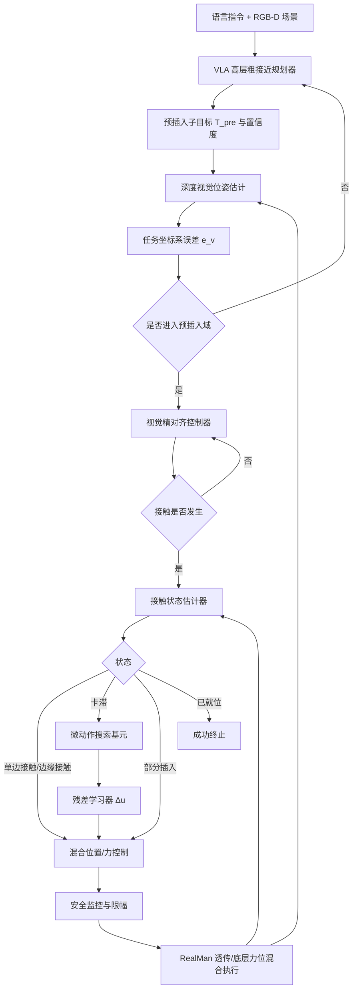
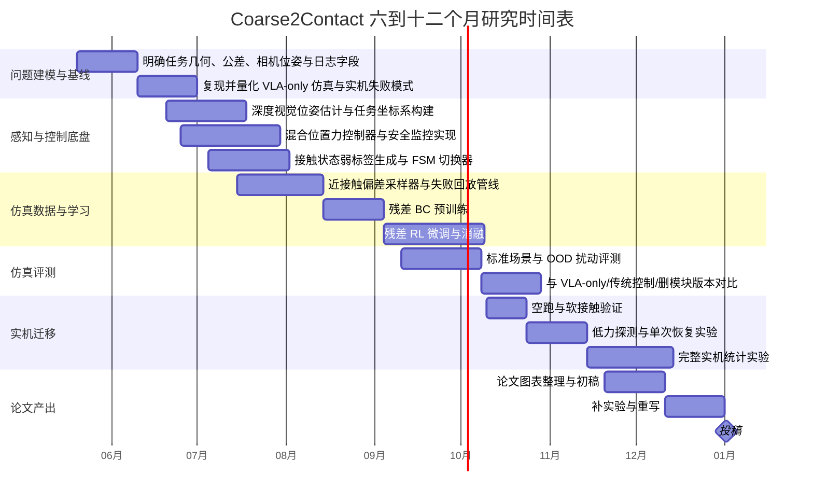

# 面向毫米级接触装配的分层式 VLA 与高精度修正器系统设计报告

## 执行摘要

基于你当前的条件——RealMan 六自由度机械臂、末端六维力矩传感器、深度相机、RLBench 仿真环境、任务 `insert_onto_red_spoke`、400 组成功轨迹、以及“VLA baseline 已具粗接近能力但实机成功率为 0”——我给出的结论是：**“VLA 作为高层粗接近规划器，底层外挂高精度视觉/力觉修正器”是可行的，而且是目前最有发表价值、工程风险最低、与你现有资产最匹配的路线。**其核心原因是，近两年的 VLA 文献已经非常清楚地表明：VLA 在语言泛化、目标理解和粗动作层面很强，但在高频闭环、动作平滑性、接触反馈利用和最后毫米级对齐上仍存在明显不足；相反，视觉伺服、混合位置/力控制、触觉/力觉驱动的局部修正器在精密插接任务上已经反复证明有效。citeturn25view0turn26view0turn27view0turn28view1turn29view1turn33view0turn34view0turn37view0

更具体地说，RT-2/OpenVLA 这一类 VLA 证明了“视觉-语言知识可迁移到机器人控制”；但 OpenVLA 作者也明确指出，在“狭窄但高灵巧”的任务上，Diffusion Policy 轨迹更平滑、精度更高，而 OpenVLA-OFT 与 π0 又进一步表明：**动作 chunking、连续动作表示和更高控制频率**对于灵巧/精细操作至关重要。与此同时，VLABench 这类更苛刻的评测显示，哪怕是经过微调的 VLA，在长时程推理、跨域迁移和复杂语言条件下的成功率仍然偏低，例如在其 Track 6（long-horizon）上，OpenVLA 的成功率仅 0.4%，π0-Base 也只有 2.0%。这为你当前“仿真可粗接近、实机 0 成功”的现象提供了直接文献支撑。citeturn41search0turn26view0turn26view2turn27view0turn28view1turn29view1turn29view2

因此，本报告直接建议构建一套可发表的分层系统：**VLA 只负责把机械臂送到“可恢复的预插入域”；视觉-力觉修正器负责最后 10–20 mm 的精配准、触碰识别、混合位力插入、卡滞检测与恢复；学习模块只学习“残差修正”和“切换策略”，而不夺走解析控制器的安全主导权。**这一设计与最新中文综述中所强调的“规划—控制分层架构”以及“先验知识 + 数据驱动”的决策框架高度一致，也与近期接触丰富操作论文中“localize-then-execute”“vision-force servoing”“visuotactile residual RL”的成功经验一致。citeturn25view0turn7search1turn38view1turn39view0turn30view2turn31view3turn32view0

从可操作性看，你现有硬件已经具备最低可行闭环：RLBench 提供 RGB/Depth/point cloud 与低维状态（包括 joint forces 等配置项）；睿尔曼官方资料显示，其 6-DoF 机型具备底层力位混合控制接口，支持六维力传感器补偿，且透传周期在不同控制器/接口下可达 10 ms，第三代有线网口最快可达 2 ms。这意味着你无需先做“端到端高频 VLA 重训”，而可以先把系统做成一个**1–2 Hz VLA + 15–30 Hz 视觉精配准 + 100 Hz 力控修正 + 10 ms 透传执行**的稳妥分层系统。citeturn20view0turn5search2turn16search1turn17view0turn18search0turn18search1

## 问题设定与未指定项

**当前任务抽象。**按你提供的信息，研究对象是 RLBench 中的 `insert_onto_red_spoke`，并计划迁移到 RealMan 实机。由于任务名更像“套接/插接 onto-spoke”而非严格的圆柱 peg-in-hole，我建议在研究中将其统一抽象为**“轴向接触类精密插接任务”**：在最后阶段都可分解为“预插入位姿建立 → 首次接触 → 接触约束下的侧向/姿态修正 → 轴向推进 → 卡滞恢复或完成”。若真实几何更接近“环套柱”而非“插头插孔”，则只需修改接触模型与终止条件，整体控制框架不变。这个抽象与近年来装配综述对轴孔/插接任务的分析一致。citeturn7search1

**你的现有资产对应的研究机会。**你已经有 400 组成功轨迹，这对“粗接近 BC/VLA warm-start”是足够的，但对“最后毫米级接触修正”并不够，因为当前数据主要是成功样本，缺少系统性的**近接触偏差、卡滞、失败与恢复**数据；而近期接触丰富任务论文恰恰表明，少量演示配合局部 RL/残差学习、或视觉/力觉局部对齐，可以显著放大数据效率并提升精度。换句话说，你缺的不是“再做一个更大的 VLA”，而是“给 VLA 补上近接触闭环”。citeturn39view0turn39view1turn27view0turn30view2

**未指定项与本报告采用的参考配置。**下面的“未指定”项，我都给出建议研究参考值；真正实施时，应在开题或实验方案中明确写出，以避免论文审稿阶段被质疑“硬件/公差条件不充分”。citeturn25view0turn7search1

| 未指定项 | 当前状态 | 本报告采用的参考配置 | 说明 |
|---|---|---:|---|
| 机械臂具体型号 | 未指定 | 参考 ECO65/RM65 量级 | 睿尔曼官方 6-DoF 机型可重复定位精度可达 ±0.05 mm；若你的机型不同，应以实机规格覆盖此假设。citeturn16search1turn18search6 |
| 控制器代际/透传接口 | 未指定 | 先按保守 10 ms 高跟随透传设计 | 官方资料显示二代控制器网口/WiFi 最快 20 ms、USB/RS485 最快 10 ms；第三代有线网口最快可达 2 ms。citeturn18search0turn18search1 |
| 深度相机型号与安装位姿 | 未指定 | 参考“固定外参 eye-to-hand 深度相机，30 Hz” | 若现机只有单固定深度相机，则近接触阶段应尽量在无遮挡区域完成视觉对齐；若日后补腕部近距相机，IBVS 效果会更好。citeturn20view0turn23search0 |
| 任务径向/角向公差 | 未指定 | 论文目标：0.5–1.0 mm 级先做稳，再冲刺 <0.3 mm | 文献中已有 0.2–0.52 mm clearance 和 <0.1 mm clearance 的结果，但需要更强视觉/触觉或更优工装。citeturn34view1turn33view0 |
| 是否允许额外被动顺应件 | 未指定 | 默认不依赖，但建议保留为可选工程增稳项 | 若 clearance 很小，被动 RCC/柔顺耦合器会显著降低失败率。此处作为工程建议而非论文核心假设。 |
| 实机允许最大接触力 | 未指定 | 初期验证按 5–8 N；成熟后视工件提高到 8–12 N | 睿尔曼六维力量程远高于该值，但论文应按工件/夹具而非传感器极限设定安全阈值。citeturn16search1turn17view1 |
| 任务是否要求绕轴特定角度对准 | 未指定 | 参考“若为 keyed 插接，则需额外控制 yaw；若为 spoke/ring 套接，则 yaw 可放宽” | 这决定混合控制中哪些自由度由位置通道控制、哪些交给顺应通道。 |

## 文献证据与技术基线

**综述层面的结论已经支持分层路线。**最新中文 VLA 综述明确把 VLA 系统区分为端到端 VLA、规划—控制式分层架构以及语言/代码驱动的高层规划器，并强调应从“感知 → 语言理解/计划 → 动作生成 → 环境反馈”的闭环误差传播来分析系统；另一个中文装配综述则指出，数据驱动轴孔装配的未来方向应聚焦“先验知识 + 数据驱动的决策框架”。这两点几乎直接对应你的目标：让 VLA 做高层语义与粗接近，让高精度修正器接管最后物理闭环。citeturn25view0turn7search1

| 方向 | 代表工作 | 年份 | 实验设置 | 关键定量结果 | 对你课题的直接启示 |
|---|---|---:|---|---|---|
| VLA 概念确立 | RT-2 citeturn41search0turn41search3 | 2023 | 6k 评估试验，把动作离散成文本 token，与互联网视觉语言任务共同训练 | 明显提升新物体泛化、可解释数字/图标/大小等语义推理 | VLA 适合高层任务理解与粗级动作，但论文焦点不是毫米级接触闭环 |
| 开源通用 VLA | OpenVLA citeturn26view0turn26view2 | 2024 | 970k 真实机器人演示训练；29 个任务跨平台评估；新机器人少样本微调 | 相比 RT-2-X 多任务绝对成功率提升 16.5%；但作者同时指出，在“狭窄但高灵巧”的任务上 Diffusion Policy 轨迹更平滑、更精确 | 你的 VLA 可保留为高层 baseline，但最后对齐不宜继续寄希望于纯自回归动作头 |
| 动作解码与频率改进 | π0 citeturn28view1turn28view0 | 2024 | 流匹配 + action chunking，高频真实机器人任务 | 控制频率可达 50 Hz；对 20 Hz 机器人每 0.8 s 推理一次、其余 50 Hz 平台每 0.5 s 推理一次；总推理时间约 73–86 ms | 高频 chunked action 明显更适合灵巧任务；说明“动作头设计”本身就是精度瓶颈 |
| OpenVLA 精调优化 | OpenVLA-OFT citeturn27view0turn27view1turn27view4 | 2025 | 研究动作表示、并行解码、action chunking 与 L1 回归目标 | LIBERO 四套任务平均成功率 76.5% → 97.1%，动作生成吞吐提升 26×；实机平均成功率最高可比 π0/RDT-1B/ACT/DP 高 15 个点 | 不是“再堆更多参数”，而是要改动作表示、解码和控制接口；这支持你做外挂修正器 |
| 更苛刻 VLA 基准 | VLABench citeturn29view0turn29view1turn29view2 | 2025 | 六条评测轨，五个 primitive 任务每轨 250 trial，轨 6 为复合长时程任务 | Track 1 成功率：OpenVLA 6.4%、π0-Base 13.2%；Track 6 成功率：OpenVLA 0.4%、π0-Base 2.0%；作者直言失败主因之一是“basic action generation inaccuracy” | 这几乎就是你实机 0 成功的公开基准版证据：复杂任务中，VLA 的“最后动作精度”仍是短板 |
| 泛化退化基准 | THE COLOSSEUM citeturn40search1turn40search0 | 2024 | 基于 RLBench 的 20 个任务、14 条环境扰动轴，并做真实世界镜像 | 多数模型在单扰动下成功率下降 30–50%，多扰动叠加下降 ≥75%；仿真与真实扰动相关性均值 \( \bar R^2 = 0.614 \) | 单纯在 RLBench 成功并不意味着实机成功；必须把标定误差、光照、相机位姿、遮挡、扰动纳入设计 |

**高精度插接与对齐方面，经典控制与近期学习方法形成了很清晰的“能力拼图”。**经典视觉伺服综述系统区分了 IBVS 与 PBVS/EBVS，并指出闭环视觉控制的本质是把视觉误差直接纳入伺服回路；混合位置/力控制与阻抗控制则分别提供了“在某些自由度跟踪位置、在另一些自由度调节接触力”的任务空间控制框架，以及“用期望机械阻抗来塑造接触行为”的系统化方法。它们是你低层修正器的理论底盘。citeturn23search0turn23search2turn24search2turn24search14

| 方法族 | 代表实现 | 传感器与控制特征 | 报告性能 | 对你系统的价值 |
|---|---|---|---|---|
| 连续视觉伺服 | Haugaard 等，CoRL 2021 citeturn36view1turn37view0 | 多相机点估计 + 连续视觉伺服；单图推理 150 Hz | 合成训练模型在 metal/plastic/wide/cap 多类插接上达 99–100% 成功，平均 1.6–3.6 s；每类 100 次 | 证明“最后对齐”可以由高速视觉伺服显著快于随机/螺旋搜索完成 |
| 学习型视觉伺服 + 螺旋搜索 + 力控 | P2HNet，Actuators 2023 citeturn34view0turn34view1turn34view2 | 视觉关键点定位 + spiral search + force control | D-sub connector，最小 clearance 0.20–0.32 mm；视觉伺服步耗时 15 ms；P2HNet 10/10，ORB 8/10 | 证明“视觉粗到细 + 小范围接触搜索 + 力控最后插入”是可发表且工程可用的套路 |
| 一次示教的视觉-力伺服 | Insert-One，IROS 2024 citeturn38view0turn38view1turn38view3 | 单张 RGB-D 示教图 + 6-DoF 跟踪 + vision-force servo + impedance | 多种新物体真实插接总体成功率 96.6%，显著高于基线 36.6%/66.6% | 强烈支持你把 “VLA 高层 + 视觉-力闭环低层” 作为论文主线，而非全端到端 |
| 触觉主动推断 | Kamijo 等，2023/2026 citeturn33view0turn33view1 | 双策略：触觉主动校正 + 力控插入 | 真实世界 clearance <0.1 mm 时成功率 90%，无触觉方法仅 5% | 当目标公差极小、视觉遮挡严重时，触觉/力觉比纯视觉更关键 |
| 少演示 + 局部 RL 的 visuotactile 精操 | ViTaL，2025 citeturn39view0turn39view2turn39view3 | 32 demos + 45 分钟在线 RL；局部策略 + 语义增强 | 四个精密接触任务在未见环境平均成功率 90%，比最佳基线高 40 个点；去掉触觉平均掉 40 个点 | 说明“局部残差 RL”很适合作为你的近接触微调器，而不必改动高层 |
| 视觉-触觉-语言动作模型 | VTLA，2025 citeturn32view0turn32view1 | 在插接仿真中融合视觉、触觉与语言，并引入 DPO | 未见 peg shape 上成功率超过 90%，优于 VLA/TLA/扩散基线 | 若你后续愿意加触觉传感器，可作为二阶段扩展方向 |
| VLA + tactile reasoning | Tactile-VLA，2025 项目页/预印本 citeturn31view0turn31view3 | token 级融合触觉；支持 CoT 恢复失败 | USB 插接 35%，充电器插接 90%，显著高于 π0-base/fast；黑板擦拭 OOD 任务 80% | 直接表明“VLA 只要加物理反馈与推理”，接触任务能力会大幅提升 |
| VLA + 六维力 MoE | ForceVLA，2025 citeturn30view0turn30view2 | 将 6 轴力反馈作为一等模态融合到动作解码 | 五类 contact-rich 任务平均成功率较 π0 基线提高 23.2%，插头插入最高到 80% | 你已有六维力传感器，这条证据与你的硬件最对口 |

**整合以上证据后，最稳妥的判断是**：VLA 适合承担“语义理解 + 目标选择 + 粗接近 + 预插入位姿建议”，而**高精度视觉伺服、混合位力控制、微动作搜索和残差学习**更适合承担“最后 10–20 mm”的闭环修正。把这两类能力解耦后再耦合，是目前既符合文献趋势、又与你条件相匹配的方案。citeturn25view0turn26view0turn28view1turn34view2turn38view1turn39view0

## 可行性判断与设计原则

**总体判断。**在你现有硬件与数据条件下，**“可行，但必须分层”**。如果仍坚持让现有 VLA baseline 端到端输出实机接触插入动作，短期内即便继续微调，成功率大概率也不会稳定越过论文可发表门槛；但如果把它降级为**预插入子目标生成器**，再用深度视觉 + 六维力矩 + 解析控制 + 小尺度残差学习做末端修正，成功率和安全性都有现实机会同时提升。这个判断不仅来自你的现象，也与 OpenVLA、π0、OpenVLA-OFT、VLABench 和近期 contact-rich 论文的系统性证据一致。citeturn26view0turn27view0turn28view1turn29view2turn39view0turn30view2

**为什么你现在的 VLA baseline 会“粗接近可以、实机成功为 0”。**第一，VLA baseline 很可能主要学到了“把末端移到目标附近”的视觉-语言映射，却没有学到接触瞬间需要的高频、低延迟、受限自由度修正；第二，它大概率没有显式利用六维力矩传感器，导致对“单边接触、倾斜插入、卡滞、摩擦、误配准”的辨识能力不足；第三，400 条成功轨迹对于粗接近 warm-start 有帮助，但对“失败-恢复”策略几乎没有覆盖；第四，RLBench 到实机之间还叠加了标定误差、相机外参误差、摩擦与接触建模误差、相机遮挡和网络时延，这类问题在 COLOSSEUM 中已被证实会显著拉低泛化表现。citeturn29view2turn30view2turn40search1turn26view0turn27view0

**本系统应坚持的五条原则。**其一，VLA 的输出不再是“完成插入的全轨迹”，而是“保证可恢复的预插入域”；其二，低层控制始终以任务坐标系里的解析控制律为主，学习模块只输出有界残差；其三，切换决策由显式状态机 + 接触状态估计器共同驱动，而不是完全黑盒；其四，视觉回路和力觉回路要异步分频运行，不能把 1–2 Hz 或几十毫秒级推理直接当作接触环路；其五，先在 RLBench 中用可控偏差大规模合成近接触样本，再做少量实机安全微调。这样的分层原则与中文 VLA 综述所强调的“规划—控制分层”和误差传播分析框架一致，也与 ViTaL 这类“localize-then-execute + residual RL”工作相吻合。citeturn25view0turn39view0

**对你硬件的现实匹配。**睿尔曼官方资料显示，六维力机型可提供底层力位补偿接口，ROS 接口文档也明确列出了 `ForcePositionMovePose` / `ForcePositionMoveJoint` 等底层力位混合控制通路；同时，透传控制在常见配置下可做到 10 ms 周期，第三代有线更快。换言之，你完全可以把“高层策略 + 外层修正器”放在上位机，而把“安全、高频、关节级执行”留在厂家底层控制与透传接口中完成，这比直接用 Python 端大模型去做高频实机闭环稳妥得多。citeturn17view0turn18search0turn18search1

**必要但不苛刻的传感器结论。**对于你当前课题，**六维力矩传感器是必需项，深度相机也是必需项；额外触觉传感器不是首发论文的刚需。**已有文献已经证明，仅用视觉伺服 + 力控就能在亚毫米 clearance 上达到高成功率；触觉/视觉-触觉方法会进一步提升极小公差和遮挡场景的鲁棒性，但那更适合作为第二阶段拓展，而不是你当前项目的阻塞项。citeturn34view2turn37view0turn33view0turn31view3

## 拟议系统方案

**建议的论文主题与可发表贡献点。**我建议将系统命名为 **Coarse2Contact**：*Hierarchical VLA Planning with Vision–Force Residual Correction for Precise Insertion*。围绕这个名字，可以明确提出至少四个可发表贡献点。第一，提出一个**可解释的 VLA-低层修正器分层框架**，将高层语义粗接近与低层近接触高精度控制解耦。第二，提出一个**视觉-力觉接触状态估计器**，用于驱动从“视觉精对齐”到“混合位力插入”再到“卡滞恢复”的显式切换。第三，提出一个**安全裁剪的残差学习器**，只在接触阶段学习小尺度修正量，从而兼顾发表创新性与实机安全性。第四，给出一套**RLBench 到 RealMan 的可复现 sim-to-real 验证协议**，把成功轨迹、近接触高频窗口和失败回放统一起来。这样的贡献结构既有算法新意，又有系统论文价值。citeturn25view0turn39view0turn38view1



**模块接口定义。**下面这张表是本报告最关键的接口约定。它明确了每个模块的输入/输出、频率、坐标系和误差边界；你后续写论文、画系统图、做 ROS 接口、定义日志字段，都可以直接按这张表展开。频率上，我建议采用“**VLA 慢回路，视觉中速回路，力控快回路**”的异步架构。这个分频设计与 π0/OpenVLA-OFT 所揭示的高频控制需求，以及睿尔曼官方透传/补偿接口能力是相容的。citeturn28view1turn27view0turn17view0turn18search0turn18search1

| 模块 | 输入 | 输出 | 频率 | 坐标系 | 错误边界或安全边界 |
|---|---|---|---:|---|---|
| VLA 高层粗接近规划器 | 语言指令、RGB-D 场景、末端位姿历史 | 预插入位姿 \(T^B_{\text{pre}}\)、抓手状态、置信度 \(q\) | 1–2 Hz | \(\{B\}, \{C\}\) | 只要求进入“可恢复预插入域”：建议 \(e_{xy}<10\) mm、\(|e_\psi|<8^\circ\)、\(z\) 间隙 < 20 mm |
| 深度视觉位姿估计 | 深度图/点云 ROI、目标与末端先验、相机外参 | 目标轴、相对位姿 \(\hat T^T_E\)、视觉误差 \(e_v=[e_x,e_y,e_\psi]\) | 15–30 Hz | \(\{C\}\to\{T\}\) | 进入接触前需压到 \(e_{xy}<1.5\) mm，\(|e_\psi|<2^\circ\) |
| 接触状态估计器 | 六维力矩 \(w_t\)、末端 twist、视觉误差历史 | \(p(c_t)\)，状态 \(c_t\in\){free, touch, edge, partial, jam, seated} | 100 Hz | \(\{T\}\) / 末端力矩坐标系 | 假阳性 jam 率目标 < 5%，假阴性 jam 率目标 < 2% |
| 视觉精对齐控制器 | \(e_v,\dot e_v\) | 任务空间校正 twist \(u_v\) | 30 Hz | \(\{T\}\) | 单步增量限幅：平移 ≤ 0.5 mm，转角 ≤ 0.5° |
| 混合位置/力控制器 | \(e_p,w_t,c_t\) | 校正 twist \(u_h\) 或增量位姿 | 100 Hz 外环；10 ms 下发 | \(\{T\}\to\{B\}\) | 初期 \(F_z \le 5\) N；成熟后 8–12 N；\(\|M_{xy}\| \le 0.25\)–0.40 N·m |
| 微动作搜索基元 | jam/edge 状态、局部残差、接触趋势 | 螺旋/摆动/回撤参数 | 20–50 Hz | \(\{T\}\) | 半径 \(r\le0.8\) mm；摆角 \(A_\theta \le 1.5^\circ\)；回撤 \(2\)–\(4\) mm |
| 残差学习器 | 最近 \(h\) 步的 \(e_v,w_t,\dot x_t,c_t\) | \(\Delta u_\theta\) | 100 Hz | \(\{T\}\) | 残差硬裁剪：每步 \(|\Delta x|,|\Delta y| \le 0.2\) mm，\(|\Delta \theta| \le 0.3^\circ\) |
| 安全监控 | 全部状态、网络延迟、力矩峰值 | Stop / Retract / Emergency Halt | 100 Hz | \(\{B\},\{T\}\) | 超上限力/力矩、连续无进度、延迟超阈值即强制回撤 |

**控制律设计。**在经典视觉伺服、混合位置/力控制和阻抗控制的基础上，我建议针对你的硬件采用一个“可解释、可限幅、可残差学习”的低层控制器。视觉精对齐阶段，采用任务坐标系 \(\{T\}\) 下的 PBVS/EBVS 型控制；由于你当前只有“深度相机”而未指定腕部近摄像头，本方案以**基于深度相对位姿的 PBVS**为主，若后续增加腕部近距相机，再切换或叠加 IBVS。其解析形式可写为：citeturn23search0turn37view0turn34view2

\[
e_v = 
\begin{bmatrix}
e_x & e_y & e_\psi
\end{bmatrix}^{\top},
\qquad
u_v = -K_v e_v - D_v \dot e_v .
\]

其中 \(e_x,e_y\) 是任务平面内偏差，\(e_\psi\) 是绕插入轴的相对偏角；\(u_v\) 只在接触前和轻接触前期起作用，目的是把系统带到“可接触但不致 jam”的区域。若未来加入腕部图像特征，可改成标准 IBVS 形式 \(v_c=-\lambda \hat L_s^{+}(s-s^\*)\)。citeturn23search0

接触发生后，控制应从“纯视觉误差驱动”切换到“视觉残差 + 力矩顺应”的混合通道。考虑到 6-DoF 机械臂在插接时冗余度有限，我建议使用“**平面内位置控制 + 轴向力控制 + 倾斜力矩顺应 + yaw 保持**”的任务空间结构。一个足够工程化、且容易复现实装的形式是：citeturn23search2turn24search2turn24search14

\[
v^{T}=
\begin{bmatrix}
-k_x e_x + \alpha_x \hat F_x\\[2mm]
-k_y e_y + \alpha_y \hat F_y\\[2mm]
k_f \left(F_z^\star-\hat F_z\right)\\[2mm]
-k_{rx}\hat M_y\\[2mm]
k_{ry}\hat M_x\\[2mm]
-k_\psi e_\psi
\end{bmatrix}
+ G\,\Delta u_\theta(o_t).
\]

这里的物理含义很直接：\(x,y\) 通道用位置误差为主、横向接触力为辅去“靠中”；\(z\) 通道以目标压入力 \(F_z^\star\) 调节推进速度；\((M_x,M_y)\) 用来释放倾斜和单边接触引发的力矩；\(\Delta u_\theta\) 是学习到的残差，只做小幅补偿。对于 spoke/ring 套接类任务，如果绕轴角度无关，则可把 \(k_\psi\) 设为 0；对于 keyed 插头插座，则需保留 yaw 闭环。这个混合通道本质上是对 Raibert-Craig 混合位力控制和 Hogan 阻抗控制的工程化实例化。citeturn23search2turn24search14

**接触状态估计器。**状态估计器不建议一上来就做复杂世界模型，而建议采用“**FSM 生成弱标签 + 轻量 GRU/TCN 分类器**”的渐进方案。输入可定义为：

\[
z_t = 
\left[
w_t,\ \dot w_t,\ \Delta x_t,\ \Delta \theta_t,\ e_v(t),\ \dot e_v(t)
\right],
\qquad 
\hat c_t = \arg\max_{c \in \mathcal C} p_\phi(c \mid z_{t-h:t}),
\]

其中 \(\mathcal C=\{\text{free}, \text{touch}, \text{edge}, \text{partial}, \text{jam}, \text{seated}\}\)。在 RLBench 中，你可以用接触事件、插入深度和成功标志自动生成弱标签；实机上再用力矩阈值与人为审查小批量修正。这样做有两个好处：第一，论文上有“显式状态估计”的新意；第二，工程上可解释，便于调试和安全收敛。近年的局部策略与视觉-触觉论文也都在某种形式上依赖清晰的阶段结构，而不是单一黑箱。citeturn39view0turn31view3turn30view2

**微动作搜索基元。**当系统被判为 edge 或 jam 时，不应继续“硬压”，而应调用一个有物理先验的小动作库。我建议至少包括三类基元。其一是**平面微螺旋**：

\[
x(t)=r(t)\cos(\omega t),\quad y(t)=r(t)\sin(\omega t),\quad
r(t)=r_0+k_r t,\ \ r(t)\le r_{\max},
\]

用于在保持低 \(F_z^\star\) 的情况下寻孔寻中。其二是**微摆动/微倾斜**：

\[
\theta_x(t)=A_\theta \sin(\omega_\theta t),\qquad
\theta_y(t)=A_\theta \cos(\omega_\theta t),
\]

用于解除单侧卡滞。其三是**回撤-再对齐-重试**，即沿插入轴回撤 2–4 mm、重跑视觉精对齐，再重新进入接触。Haugaard、P2HNet、Insert-One 和主动推断类工作都以不同方式证明了：在精密插接中，小范围局部搜索和顺应校正比“盲推”有效得多。citeturn37view0turn34view2turn38view1turn33view0

**残差学习策略。**建议不要让学习器直接替代解析控制器，而是学习一个安全裁剪的残差：

\[
u_t = \operatorname{sat}\Big(u_{\text{analytic}}(s_t) + G\,\Delta u_\theta(o_t)\Big).
\]

训练分三步。第一步，用你现有 400 条成功轨迹训练或蒸馏出粗接近策略，保持现有 VLA baseline。第二步，在 RLBench 中系统性采样预插入偏差，生成“可恢复失败”与“卡滞恢复”数据，用解析控制器 + 少量 oracle 规则先跑出一批近接触演示，再对残差头做 BC 预训练。第三步，再在仿真中做**残差 RL**，奖励只围绕“成功插入、峰值力更小、恢复更快、卡滞更少”设计；最后把残差策略蒸馏成部署版。ViTaL 已经证明“少演示 + 短时 RL + 残差修正”对 contact-rich 任务极其有效，而你的任务比它更适合用显式控制器托底。citeturn39view0turn39view1

**建议的主循环伪代码。**

```python
for each control step t:
    obs = get_rgbd_ft_pose()

    if phase == "COARSE":
        T_pre, q = VLA(obs_full, instruction)
        move_to(T_pre)
        if in_preinsert_region(obs):
            phase = "VISUAL_ALIGN"

    elif phase == "VISUAL_ALIGN":
        e_v = estimate_visual_error(obs_depth)
        u_v = visual_servo(e_v)
        send_increment(u_v)
        if aligned_for_probe(e_v):
            phase = "PROBE"

    elif phase == "PROBE":
        send_force_setpoint(Fz_star_low)
        c = contact_estimator(obs)
        if c in ["touch", "edge", "partial"]:
            phase = "INSERT"
        elif timeout():
            phase = "RECOVER"

    elif phase == "INSERT":
        c = contact_estimator(obs)
        u_h = hybrid_force_position(obs, c)
        du  = clipped_residual(obs_window, c)
        send_increment(u_h + du)
        if success_detected(obs):
            phase = "DONE"
        elif jam_detected(obs):
            phase = "RECOVER"

    elif phase == "RECOVER":
        primitive = choose_micro_motion(obs)
        execute(primitive)
        if recovered(obs):
            phase = "VISUAL_ALIGN"
        elif too_many_retries():
            safe_retract()
            phase = "FAIL"
```

**建议的切换阈值。**下面这些数值不是文献“标准答案”，而是我建议你在论文中明确列出的**参考配置**：VLA→视觉精对齐切换条件取 \(e_{xy}<10\) mm、\(|e_\psi|<8^\circ\)、\(z\) gap < 20 mm；视觉精对齐→试探接触取 \(e_{xy}<1.5\) mm、\(|e_\psi|<2^\circ\) 且稳定 5 帧；接触 onset 判据可取 \(F_z>1.0\) N 或 \(\Delta F_z > 0.5\) N/20 ms；jam 判据可取 \(F_z>6\) N 且 0.4 s 内 \(\Delta z < 0.5\) mm，或 \(\|M_{xy}\|>0.25\) N·m；初期最大尝试次数建议 3 次。若实机夹具更刚、工件更脆，可再下调。这里的关键不是某个阈值绝对最优，而是**阈值必须显式、可复现实验、可做消融**。  

## 实验验证与实施计划

**RLBench 仿真验证设计。**我建议你先把现有 400 条成功轨迹做一个干净的固定拆分：320 条训练、40 条验证、40 条测试；随后在 RLBench 中围绕预插入区域自动生成大量偏差样本，而不是继续盲目增加全流程成功轨迹。RLBench 本身支持多视角视觉、深度和低维观测，并可通过其任务机制持续生成演示；COLOSSEUM 又提供了面向 RLBench 的扰动评测思路。因此，仿真实验不应只做“标准场景成功率”，而应覆盖颜色/光照/相机位姿/背景/干扰物等 OOD 扰动。citeturn5search2turn20view0turn40search1turn40search5

建议的实验组如下。**基线组**至少包含：VLA-only；VLA + 力阈值直插（无状态估计）；VLA + 视觉精对齐（无力控）；VLA + 力控修正（无视觉精对齐）；视觉/力传统控制器（无 VLA，高层位姿由 GT 或常规感知给出）；Full system。**消融组**至少包含：去掉接触状态估计器；去掉微动作基元；去掉残差学习；去掉失败回放；去掉域随机化；切换阈值放宽/收紧；只用 F/T 或只用 depth。每组建议 5 个随机种子，ID 场景每组 100 次试验，OOD 每个扰动轴 50–100 次、多扰动组合再做 100 次，确保能做显著性检验。citeturn29view2turn40search1

**数据采集与标注规范。**建议把数据分成三层。第一层是**粗接近层**：保存 RGB-D、语言指令、末端位姿、夹爪状态、VLA 输出子目标，频率可用 10–15 Hz 或相机原始频率。第二层是**近接触高频层**：以“距首次接触前 1.5 s 到完成/失败后 1.5 s”为窗口，保存 100 Hz 的六维力矩、末端位姿/速度、控制指令、状态机状态，视觉部分至少保存 15–30 Hz 的深度 ROI。第三层是**失败回放层**：刻意施加 \(x,y\) 偏差、\(z\) gap、yaw 偏差、外参误差、延迟和遮挡，记录 jam 类型与恢复结果。论文级别的数据建议是：在现有 400 条成功轨迹之外，再额外构造 **1500–3000 条仿真近接触偏差样本**，其中 recoverable-failure 至少占 40%；再补 **100–200 次实机安全接触回放** 与 **200–400 次失败/恢复实机日志**。这样才能把“最后毫米”的学习问题真正建起来。  

| 数据层 | 采集内容 | 标注建议 | 频率 | 建议规模 |
|---|---|---|---:|---:|
| 粗接近轨迹 | RGB-D、语言、末端位姿、VLA 子目标 | 成功/失败、到达预插入域时间 | 10–15 Hz | 现有 400 条即可作为起点 |
| 近接触窗口 | 六维力矩、末端 twist、深度 ROI、控制指令 | free/touch/edge/partial/jam/seated 弱标签 + 人工抽检 | 力觉 100 Hz；视觉 15–30 Hz | 仿真 1500–3000 窗口 |
| 失败回放 | 偏差注入、遮挡、延迟、外参误差 | jam 类型、回撤是否成功、最终失败原因 | 同上 | 实机 200–400 组 + 安全试探回放 100–200 组 |

**评价指标与统计检验。**主指标建议至少包含：任务成功率 SR、首次接触后成功率 FCSR、平均插入时间、最大法向力 \(F_{z,\max}\)、最大力矩 \(\|M_{xy}\|_{\max}\)、平均恢复次数、平均回撤次数、轨迹长度、最终就位误差、实机/仿真迁移差 \(\Delta SR\)。对于二元成功率，报告 **Wilson 95% 置信区间**，组间比较优先使用 **Fisher 精确检验**；若同一初始场景在两方法上成对测试，则采用 **McNemar 检验**。对插入时间、峰值力等连续指标，优先报告均值±标准差与 bootstrap 95% CI，并结合 Mann–Whitney U 检验或配对置换检验。若消融实验很多，建议用 Holm-Bonferroni 做多重比较修正。论文中不要只给 p 值，还要报告**绝对提升值、风险差、Cliff’s delta 或赔率比**。  

**从 RLBench 迁移到 RealMan 的安全验证步骤。**我建议按如下顺序逐级推进。先做“纯视觉空跑”，在目标上方固定 10–20 mm 高度完成 VLA→视觉精对齐切换验证，不接触工件。再做“软夹具接触”，把真实接触换成软泡棉或大容差导向件，验证接触 onset、jam 检测和回撤逻辑。然后做“低力探测”，把 \(F_z^\star\) 限在 3–5 N，并把最大尝试次数限制为 1–2 次。确认日志、触发、急停和回撤都可靠后，再逐步提高插入力、缩小容差、增加扰动、开放多次恢复。由于官方手册明确提醒六维力传感器超载会造成不可逆损伤，前期所有轨迹验证都应降速进行。citeturn17view1turn16search3

**风险清单与缓解措施。**

| 风险 | 具体表现 | 缓解措施 |
|---|---|---|
| 标定误差 | 仿真成功、实机偏一个方向持续碰边 | 每日自动做相机-基座-末端外参校验；把外参误差作为仿真扰动轴；切换阈值前保留视觉重估 |
| 深度遮挡 | 接近插入口后目标边缘被末端挡住 | 在接触前完成主要视觉对齐；近接触改由 F/T 主导；必要时增加腕部近距相机作为扩展 |
| 控制延迟 | 100 Hz 外环不稳定、过冲增大 | 上位机与控制节点分进程；固定网口；先按 10 ms 保守设计；验证控制器代际后再提速 |
| 接触模型差异 | RLBench 中可恢复，实机却持续 jam | 把 RLBench 用作“偏差生成器”而非真实物理替身；实机做小规模残差蒸馏/校正 |
| 数据偏好成功样本 | 学会接近但不会恢复 | 增加系统性失败回放；恢复段 oversampling；构建 jam 类别标签 |
| 六自由度冗余不足 | 某些姿态下难同时满足接近和顺应 | 在任务设计上优先约束工件/夹具；必要时引入被动顺应件或重新设计预插入姿态 |
| 工件/夹具刚度高 | 峰值力突增、损伤夹具或传感器 | 使用牺牲件、限力限速、硬件急停、回撤优先于继续插入 |
| VLA 不稳定输出 | 子目标频繁跳动、难以切换 | 对 VLA 输出做子目标滤波和置信度门控；进入低层后冻结高层直到恢复/失败 |

**硬件与软件栈建议。**软件上，建议继续以 RLBench/PyRep/Python 作为仿真与数据管线，PyTorch 训练 VLA 残差头和接触估计器；实机侧建议使用 ROS Noetic 或 ROS 2 作为消息总线，但**运动执行最好直接走睿尔曼官方 SDK/透传接口**，而不是让 MoveIt 进入运行时接触闭环。MoveIt 适合做初始化、URDF、自碰撞和调试，不适合承担 100 Hz 的插接环。硬件上，你已有深度相机与六维力矩已经够启动；建议增加一个**可更换的宽公差引导夹具**作为早期验证工具，以及一个**牺牲件/3D 打印工装**来降低试错成本。睿尔曼官方产品页与手册显示，六维力版本的 6-DoF 机型在这一类协作装配任务上具备基础硬件条件。citeturn16search1turn17view0turn17view1

**论文写作建议与投稿方向。**图表上，我建议至少准备以下几类：系统总览图；状态切换图；“VLA 粗接近 → 精对齐 → 接触 → 恢复”的时序可视化；成功/失败案例拼图；力-位移曲线；切换阈值和残差控制的消融表；不同初始偏差下的成功率热图；仿真到实机的散点图；以及与 VLABench/COLOSSEUM 风格一致的 OOD 评测图。英文投稿优先可考虑 **IROS / ICRA / CoRL / RSS workshop / RA-L** 路线；若更强调系统与实机验证，RA-L + ICRA/IROS presentation 是合适选择。中文方面，可考虑《机器人》《自动化学报》《机械工程学报》等偏机器人控制与系统论文的期刊。标题上，建议突出“Hierarchical VLA”“Vision-Force Residual Correction”“Precise Insertion”“Sim-to-Real”这些关键词。  

## 结论与路线图

**最终结论。**对你的课题，最合理的答案不是“继续把 VLA 做大”，而是**把 VLA 的职责边界收窄到它真正擅长的层级：语义理解、目标识别、粗接近和预插入位姿建议；再把毫米级接触闭环交给显式的视觉-力觉修正器。**从文献证据看，这是当前最符合事实的技术分工；从工程实现看，这与你的 RealMan + 六维力 + 深度相机 + RLBench + 400 成功轨迹的资源配置高度匹配；从论文发表看，这一路线同时具备“算法增量明确、系统价值清楚、实验可复现”的优势。citeturn25view0turn26view0turn27view0turn29view2turn34view2turn39view0

**一句话建议。**先把论文目标定为：**在 RLBench `insert_onto_red_spoke` 上做出一个可解释、可切换、可恢复的分层系统，在仿真中显著超过 VLA-only，在实机上把成功率从 0 提升到可重复、可统计显著的水平；然后再以残差学习和接触状态估计作为亮点冲击更高层次发表。**如果初次实机目标需要一个务实数字，我建议把论文最低目标设为：**实机成功率 ≥ 60%，相对 VLA-only 提升 ≥ 30 个百分点，峰值接触力下降 ≥ 25%，恢复后再插成功率 ≥ 50%。**这些目标既不保守，也不过分脱离现实。  

**开放问题与局限。**本报告仍有三点必须在开题或实验初期尽快落实。第一，`insert_onto_red_spoke` 的真实几何与容差尚未明确；若真实公差逼近 0.1–0.2 mm，只有单外部深度相机和六维力矩可能不足以长期稳定，需要被动顺应件或补充近距视觉/触觉。第二，RealMan 控制器代际与实际可用透传周期尚未确认，这会影响你能否把快环从 100 Hz 提到 200–500 Hz。第三，RLBench 的接触物理可用于训练切换与恢复逻辑，但不应被视作实机接触真值替代，因此实机安全微调和失败回放是不可省的。citeturn33view0turn16search1turn18search0turn40search1



**里程碑建议。**两个月内拿到“传统视觉-力控外挂后，实机从 0 到第一次稳定成功”；四个月内拿到“Full system 在仿真中显著优于 VLA-only，并完成 OOD 扰动评测”；六个月内拿到“实机统计显著结果 + 消融表 + 失败分析图”；九到十二个月内完成英文主稿和一篇偏中文系统论文或技术报告的并行产出。这样安排最符合你当前资源禀赋，也最容易把工作做成“论文 + 可复现实验系统”两条线同时成立。